# 201 Escape

채용 공고를 한 곳에서 관리하는 모바일 친화적인 지원 현황 대시보드입니다.

**https://201-escape.vercel.app**

지원 상태를 한 곳에서 추적합니다.
회사명과 포지션을 직접 입력하거나, 로컬 환경에서는 원티드·사람인 URL을 붙여넣어 자동 파싱할 수 있습니다.

## 목차

- [주요 기능](#주요-기능)
- [화면 미리보기](#화면-미리보기)
- [빠른 시작](#빠른-시작)
- [환경 변수](#환경-변수)
- [설치 및 실행](#설치-및-실행)
- [데이터베이스 스키마](#데이터베이스-스키마)
- [스크립트](#스크립트)
- [핵심 사용자 흐름](#핵심-사용자-흐름)
- [아키텍처](#아키텍처)
- [이벤트 트래킹](#이벤트-트래킹)
- [프로젝트 구조](#프로젝트-구조)
- [알려진 제약사항](#알려진-제약사항)
- [구현 참고 글](#구현-참고-글)

## 주요 기능

- **직접 입력**: 회사명, 포지션, URL을 직접 입력해 공고 추가
- **공고 자동 파싱** _(로컬 전용)_: 원티드, 사람인 URL에서 회사명, 직책, 공고 내용을 자동으로 추출
- **지원 상태 관리**: 관심 → 서류 제출 → 서류 통과 → 면접 중 → 최종 합격 / 불합격
- **탭 기반 필터링**: 지원 상태별로 목록 필터링
- **무한 스크롤 + 가상 리스트**: 대량 공고도 부드럽게 렌더링
- **지원 상세 페이지**: 공고 원문 편집, 메모 작성, 면접 일정 관리
- **면접 일정 관리**: 면접 유형·회차·일시 등록 및 삭제

## 화면 미리보기

### 대시보드

<table>
  <tr>
    <td align="center"><strong>KPI 요약</strong></td>
    <td align="center"><strong>주요 비율</strong></td>
  </tr>
  <tr>
    <td>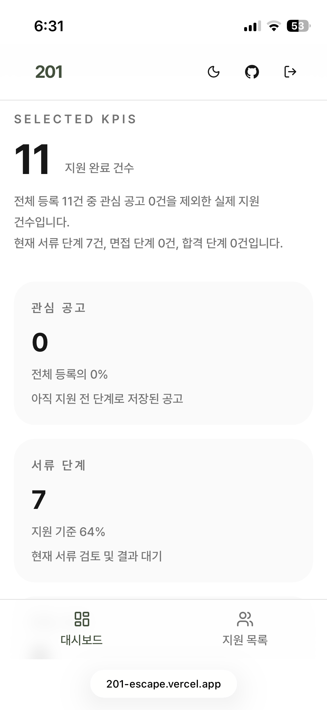</td>
    <td>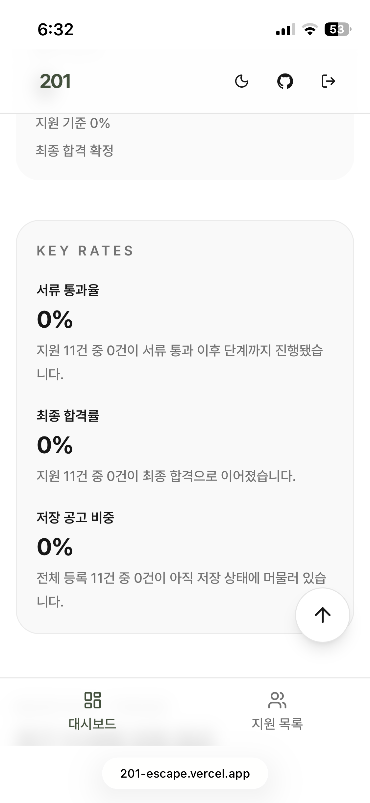</td>
  </tr>
</table>

<table>
  <tr>
    <td align="center"><strong>단계별 퍼널</strong></td>
    <td align="center"><strong>월간 지원 추이</strong></td>
  </tr>
  <tr>
    <td>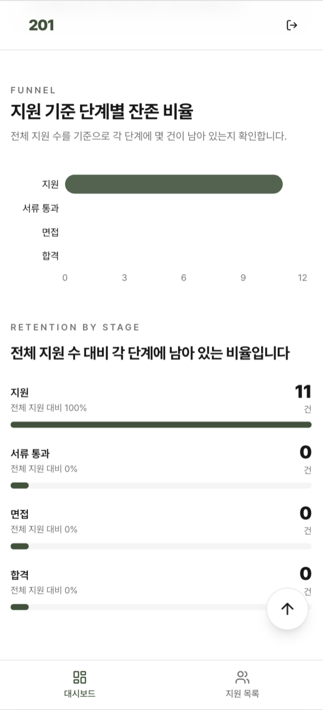</td>
    <td>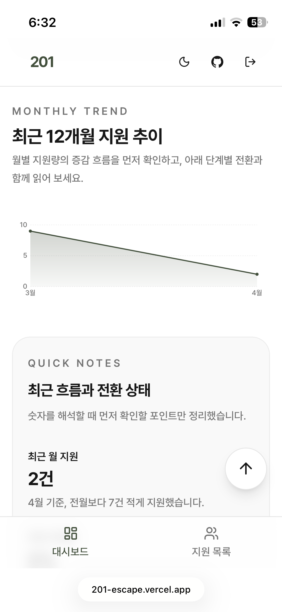</td>
  </tr>
</table>

지원 건수, 핵심 전환율, 단계별 잔존 비율, 최근 월별 추이를 한 화면에서 확인할 수 있습니다.

### 지원 목록과 빠른 액션

<table>
  <tr>
    <td align="center"><strong>지원 목록</strong></td>
    <td align="center"><strong>검색</strong></td>
  </tr>
  <tr>
    <td>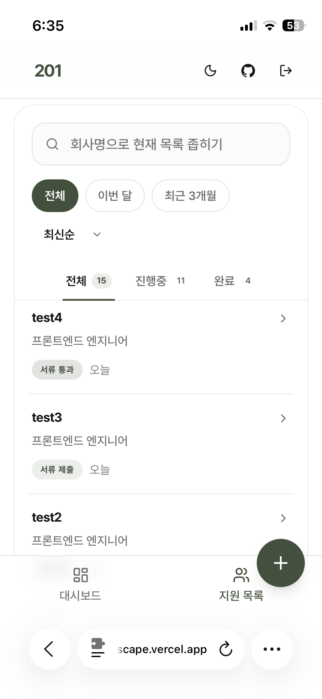</td>
    <td>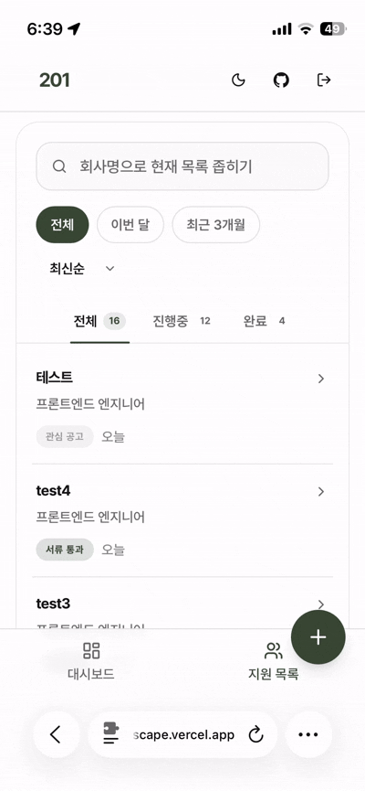</td>
  </tr>
</table>

<table>
  <tr>
    <td align="center"><strong>미리보기 시트</strong></td>
    <td align="center"><strong>공고 추가</strong></td>
  </tr>
  <tr>
    <td>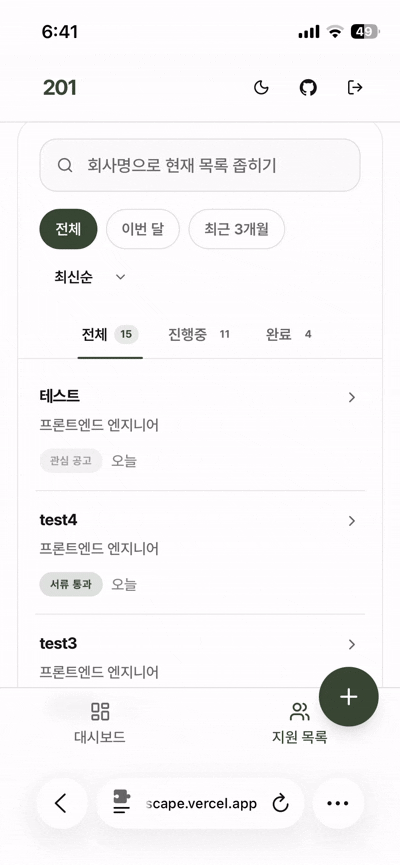</td>
    <td>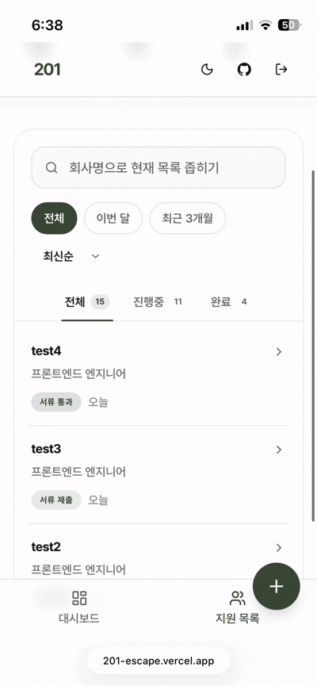</td>
  </tr>
</table>

목록에서 상태별 탐색과 검색을 수행하고, 미리보기 시트 확인과 FAB 기반 공고 추가까지 빠르게 이어집니다.

### 지원 상세와 후속 관리

<table>
  <tr>
    <td align="center"><strong>상세 정보</strong></td>
    <td align="center"><strong>면접 일정 추가</strong></td>
  </tr>
  <tr>
    <td>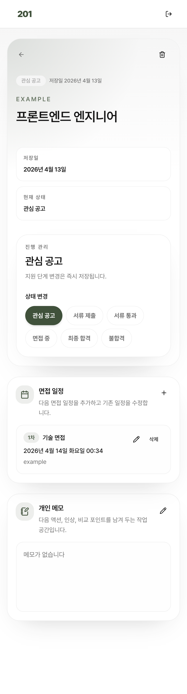</td>
    <td>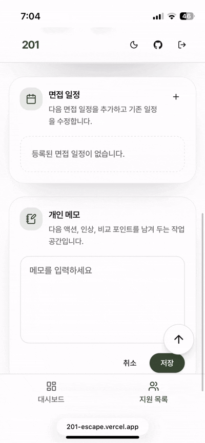</td>
  </tr>
</table>

<table>
  <tr>
    <td align="center"><strong>개인 메모 추가</strong></td>
  </tr>
  <tr>
    <td>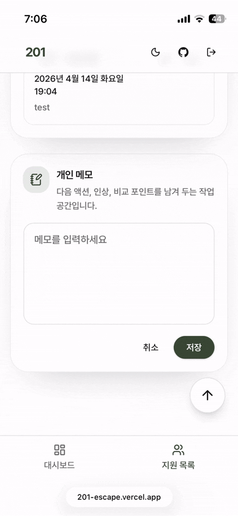</td>
  </tr>
</table>

상세 페이지에서는 지원 단계 확인, 면접 일정 추가, 메모 기록 등 후속 액션을 한 흐름에서 관리할 수 있습니다.

## 기술 스택

- **Framework**: Next.js 16(App Router, TypeScript), React 19
- **Server State**: TanStack Query v5
- **Database & Auth**: Supabase(PostgreSQL, Google OAuth)
- **Styling**: TailwindCSS v4, CVA, tailwind-merge
- **Validation**: Zod
- **Parsing**: Cheerio(서버 사이드 HTML 파싱)
- **Charts**: 커스텀 SVG 차트(퍼널, 월간 추이 차트)
- **Analytics**: PostHog(이벤트 트래킹, 사용자 식별)
- **Error Tracking**: Sentry
- **Test**: Vitest, Storybook
- **Code Quality**: ESLint, Prettier, Husky, lint-staged

## 빠른 시작

### 요구 사항

- Node.js 20+
- pnpm

### 환경 변수

`.env.example`을 복사해 `.env.local`을 만들고 값을 채웁니다.

```bash
cp .env.example .env.local
```

권장 순서:

1. Supabase 프로젝트를 생성합니다.
2. **Project Settings → API**에서 `NEXT_PUBLIC_SUPABASE_URL`, `NEXT_PUBLIC_SUPABASE_PUBLISHABLE_KEY`를 복사합니다.
3. **Authentication → Providers**에서 Google OAuth를 활성화하고 리디렉션 URL을 설정합니다.
4. `supabase/migrations/`의 마이그레이션을 적용합니다.
5. `.env.local`을 채운 뒤 `pnpm dev`로 앱을 실행합니다.

| 변수                                   | 설명                                                              |
| -------------------------------------- | ----------------------------------------------------------------- |
| `NEXT_PUBLIC_SUPABASE_URL`             | Supabase 프로젝트 URL                                             |
| `NEXT_PUBLIC_SUPABASE_PUBLISHABLE_KEY` | Supabase Publishable Key                                          |
| `NEXT_PUBLIC_ENABLE_PARSING`           | `true`로 설정 시 URL 자동 파싱 활성화(로컬 전용, 기본값: `false`) |
| `POSTHOG_PROJECT_TOKEN`                | 서버에서 사용하는 PostHog 프로젝트 API Key                        |
| `POSTHOG_HOST`                         | 서버에서 사용하는 PostHog API Host                                |
| `SENTRY_AUTH_TOKEN`                    | Sentry 소스맵 업로드 및 빌드 연동에 사용하는 인증 토큰            |
| `NEXT_PUBLIC_SENTRY_DSN`               | Sentry DSN                                                        |
| `NEXT_PUBLIC_ENABLE_BROWSER_SENTRY`    | `true`로 설정 시 브라우저 Sentry 활성화(기본값: `false`)          |

`NEXT_PUBLIC_SUPABASE_URL`과 `NEXT_PUBLIC_SUPABASE_PUBLISHABLE_KEY`는 Supabase 대시보드의 **Project Settings → API** 페이지에서 확인할 수 있습니다.

> **참고**: `NEXT_PUBLIC_ENABLE_PARSING`의 기본값은 `false`입니다. 원티드·사람인 URL 자동 파싱이 필요할 때만 로컬 개발 환경에서 `true`로 켜세요. 프로덕션 환경에서는 외부 사이트 이용약관 이슈로 해당 기능을 비활성화합니다.

### 설치 및 실행

```bash
pnpm install
pnpm dev
```

`http://localhost:3000`에서 확인할 수 있습니다.

## 데이터베이스 스키마

Supabase 프로젝트에 아래 테이블이 필요합니다. `supabase/migrations/` 폴더의 마이그레이션 파일로 적용할 수 있습니다.

최종 스키마 구조와 인덱스, RLS 정책은 [`docs/database-schema.md`](./docs/database-schema.md)에서 설명합니다.

| 테이블         | 설명                                                                              |
| -------------- | --------------------------------------------------------------------------------- |
| `applications` | 사용자 소유 지원 기록. 공고 메타데이터, 상태, 메모, 원본 데이터(JSON)를 함께 저장 |
| `interviews`   | 면접 일정. 특정 지원(`application`)에 종속된 회차/유형/일시 정보를 저장           |

### 지원 상태

```
SAVED → APPLIED → DOCS_PASSED → INTERVIEWING → OFFERED
                                              ↘ REJECTED
```

### 지원 플랫폼

- `WANTED`: 원티드(자동 파싱, 로컬 전용)
- `SARAMIN`: 사람인(자동 파싱, 로컬 전용)
- `LINKEDIN`: LinkedIn(수동 입력)
- `MANUAL`: 직접 입력

## 스크립트

```bash
pnpm dev             # 개발 서버 실행
pnpm build           # 프로덕션 빌드
pnpm start           # 프로덕션 서버 실행
pnpm lint            # ESLint 실행
pnpm test            # Vitest 테스트 실행
pnpm bench           # VirtualList 벤치마크 실행
pnpm storybook       # Storybook 실행(포트 6006)
pnpm build-storybook # Storybook 정적 빌드
```

## 핵심 사용자 흐름

1. 로그인 후 지원 목록 화면에서 전체 지원 기록을 확인합니다.
2. 새 공고는 직접 입력하거나, 로컬 환경에서만 URL 자동 파싱으로 초안을 채울 수 있습니다.
3. 지원 상태를 `SAVED → APPLIED → DOCS_PASSED → INTERVIEWING → OFFERED / REJECTED` 흐름으로 관리합니다.
4. 상세 페이지에서 공고 원문, 개인 메모, 면접 일정을 함께 관리합니다.
5. 대시보드에서 상태별 개수와 추이 차트를 확인합니다.

## 아키텍처

### 데이터 흐름

주요 데이터 조회와 수정은 클라이언트 UI에서 Server Action을 호출하고, 서버에서 Supabase RLS 정책을 통과한 결과만 다시 UI에 반영하는 흐름으로 구성되어 있습니다.

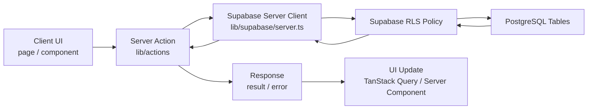

### 기술 스택 표

| 라이브러리 / 기술        | 역할                                         |
| ------------------------ | -------------------------------------------- |
| Next.js 16 App Router    | 라우팅, 서버 컴포넌트, 서버 액션 실행        |
| React 19                 | UI 렌더링과 상호작용 구성                    |
| TypeScript               | 정적 타입 검사와 명시적 데이터 모델링        |
| Supabase                 | 인증, PostgreSQL, RLS 기반 데이터 접근 제어  |
| TanStack Query v5        | 클라이언트 조회 캐시, 무한 스크롤, hydration |
| Tailwind CSS v4          | 유틸리티 기반 스타일링                       |
| class-variance-authority | 컴포넌트 variant 조합 관리                   |
| tailwind-merge           | Tailwind 클래스 충돌 정리                    |
| Zod                      | 입력값 및 도메인 스키마 검증                 |
| Cheerio                  | 서버 사이드 HTML 파싱                        |
| 커스텀 SVG 차트          | 대시보드 퍼널 및 월간 추이 차트 렌더링       |
| PostHog                  | 사용자 이벤트 트래킹과 식별                  |
| Sentry                   | 런타임 오류 수집과 추적                      |
| Vitest                   | 단위 테스트와 벤치마크 실행                  |
| Storybook                | UI 상태 문서화와 수동 검증                   |
| ESLint / Prettier        | 정적 분석과 코드 포맷팅                      |
| Husky / lint-staged      | 커밋 전 품질 체크 자동화                     |

## 이벤트 트래킹

[PostHog](https://posthog.com)를 사용해 핵심 사용자 행동을 측정합니다. 클라이언트 이벤트는 `/api/events`로 수집한 뒤 서버에서 PostHog로 전달하고, 서버 액션 성공 이벤트는 `posthog-node`로 직접 발송합니다.

### 이벤트 목록

| 이벤트명                     | 발생 시점                      | 프로퍼티                           |
| ---------------------------- | ------------------------------ | ---------------------------------- |
| `login_attempted`            | Google 로그인 버튼 클릭        | -                                  |
| `application_add_opened`     | 공고 추가 FAB 클릭             | -                                  |
| `application_add_submitted`  | 수동 폼 제출 → 리뷰 단계 진입  | `has_url: boolean`                 |
| `application_add_saved`      | 공고 저장 완료                 | -                                  |
| `application_add_reset`      | 리뷰 단계에서 "다시 입력" 클릭 | -                                  |
| `application_preview_opened` | 대시보드에서 지원 행 클릭      | -                                  |
| `application_status_changed` | 지원 상태 변경 성공            | `from_status`, `to_status`         |
| `application_deleted`        | 지원 삭제 완료                 | -                                  |
| `interview_added`            | 면접 일정 추가 완료            | `interview_type`, `round`          |
| `interview_edited`           | 면접 일정 수정 완료            | `interview_type`, `round`          |
| `interview_deleted`          | 면접 일정 삭제 완료            | -                                  |
| `job_description_saved`      | 공고 설명 저장 완료            | -                                  |
| `memo_saved`                 | 개인 메모 저장 완료            | -                                  |
| `applications_tab_changed`   | 지원 목록 탭 전환              | `tab: 'all' \| 'active' \| 'done'` |

### 퍼널 설정(PostHog 대시보드)

PostHog → **Insights** → **New insight** → **Funnels**

#### 공고 추가 퍼널

| 단계   | 이벤트                      |
| ------ | --------------------------- |
| Step 1 | `application_add_opened`    |
| Step 2 | `application_add_submitted` |
| Step 3 | `application_add_saved`     |

FAB 클릭 → 폼 제출 → 저장 완료 각 단계의 이탈률을 확인할 수 있습니다.

#### 지원 상태 진행 퍼널

순서 무관(Unordered) 퍼널로 설정합니다.

| 단계   | 이벤트                       | 필터                       |
| ------ | ---------------------------- | -------------------------- |
| Step 1 | `application_status_changed` | `to_status = APPLIED`      |
| Step 2 | `application_status_changed` | `to_status = DOCS_PASSED`  |
| Step 3 | `application_status_changed` | `to_status = INTERVIEWING` |
| Step 4 | `application_status_changed` | `to_status = OFFERED`      |

지원 제출 이후 서류 통과 → 면접 → 최종 합격까지 각 단계의 잔존율을 확인할 수 있습니다.

### 사용자 식별

이벤트 전송 시 로그인한 사용자의 Supabase user ID를 PostHog `distinct_id`로 사용합니다. 로그인하지 않은 요청은 `anonymous`로 기록합니다.

## 프로젝트 구조

```text
app/
├── (protected)/                      # 인증 필요 라우트 그룹
│   ├── ProtectedProviders.tsx        # 보호 영역 지연 마운트 provider
│   ├── _components/                  # 보호 영역 공통 UI
│   ├── applications/                 # 지원 목록, 추가 플로우, 상세 페이지
│   │   ├── ApplicationsProviders.tsx # applications 전용 provider
│   │   ├── _components/              # applications 라우트 전용 UI
│   │   │   ├── add-job/              # 공고 추가 feature
│   │   │   │   ├── components/       # add-job 내부 UI 조각
│   │   │   │   ├── hooks/            # add-job 내부 상태/행동
│   │   │   │   └── utils/            # add-job 내부 보조 유틸
│   │   │   ├── components/           # 목록 화면 내부 UI 조각
│   │   │   └── go-to-top/            # 상단 이동 FAB
│   │   ├── _utils/                   # applications 라우트 전용 유틸
│   │   └── [applicationId]/          # 지원 상세(메모, 면접 일정, 공고 원문)
│   │       └── _components/          # 상세 라우트 전용 UI
│   └── dashboard/                    # 지원 현황 통계 대시보드
│       ├── _components/              # dashboard 라우트 전용 UI
│       └── _utils/                   # dashboard 라우트 전용 유틸
├── _components/                      # 공개 라우트 공통 UI
│   └── landing/                      # 랜딩 feature
│       └── utils/                    # landing 내부 보조 유틸
├── _fonts/                           # 폰트 에셋
├── auth/                             # OAuth 콜백 처리
├── login/                            # 로그인 페이지
├── privacy/                          # 개인정보처리방침
│   ├── _components/                  # privacy 라우트 전용 UI
│   └── _utils/                       # privacy 라우트 전용 유틸
├── layout.tsx                        # 루트 레이아웃
└── page.tsx                          # 랜딩 페이지 엔트리

components/
├── ui/                               # 재사용 UI 컴포넌트
│   ├── bottom-sheet/                 # 바텀 시트
│   ├── button/                       # 버튼
│   ├── skeleton/                     # 스켈레톤 로딩
│   ├── tab-selector/                 # 탭 셀렉터
│   ├── tabs/                         # 탭
│   └── virtual-list/                 # 가상 리스트
└── common/                           # Portal, FocusTrap 등 공통 컴포넌트

hooks/                                # 공유 커스텀 훅

lib/
├── actions/                          # Server Actions
├── adapters/                         # 플랫폼별 공고 파서
├── constants/                        # 상태·플랫폼·인터뷰 타입 상수
├── posthog/                          # 이벤트 트래킹 프로바이더/유저 동기화
├── sentry/                           # Sentry 사용자 동기화
├── supabase/                         # Supabase 클라이언트
├── types/                            # 타입 정의 및 Zod 스키마
└── utils/                            # 순수 유틸리티 함수

supabase/
└── migrations/                       # DB 스키마 및 정책 마이그레이션
```

- `app/<route>` 바로 아래의 내부 폴더는 `_components`, `_utils`처럼 `_`를 붙입니다.
- 그 아래 feature 내부 폴더는 `components`, `hooks`, `utils`처럼 역할 이름만 사용합니다.

## 알려진 제약사항

- 원티드·사람인 URL 자동 파싱은 외부 HTML 구조 변경에 영향을 받습니다.
- URL 자동 파싱은 `NEXT_PUBLIC_ENABLE_PARSING=true`일 때만 동작하며, 외부 사이트 이용약관 이슈로 프로덕션에서는 비활성화되어 있습니다.
- PostHog, Sentry는 관련 환경 변수가 비어 있으면 일부 관측 기능이 비활성화될 수 있습니다.

## 구현 참고 글

프로젝트의 주요 UI 컴포넌트를 구현하며 정리한 글입니다. 구조 선택과 리팩토링 배경이 궁금할 때 참고할 수 있습니다.

- [컴파운드 컴포넌트 패턴으로 탭 구현하기](https://velog.io/@csh001231/%EC%BB%B4%ED%8C%8C%EC%9A%B4%EB%93%9C-%EC%BB%B4%ED%8F%AC%EB%84%8C%ED%8A%B8-%ED%8C%A8%ED%84%B4%EC%9C%BC%EB%A1%9C-%ED%83%AD-%EA%B5%AC%ED%98%84%ED%95%98%EA%B8%B0)
- [우아하게 구현하는 바텀시트: 제스처 훅 설계](https://velog.io/@csh001231/%EC%9A%B0%EC%95%84%ED%95%98%EA%B2%8C-%EA%B5%AC%ED%98%84%ED%95%98%EB%8A%94-%EB%B0%94%ED%85%80%EC%8B%9C%ED%8A%B8-%EC%A0%9C%EC%8A%A4%EC%B2%98-%ED%9B%85-%EC%84%A4%EA%B3%84)
- [우아하게 구현하는 바텀시트: Portal부터 Compound Component까지](https://velog.io/@csh001231/%EC%9A%B0%EC%95%84%ED%95%98%EA%B2%8C-%EA%B5%AC%ED%98%84%ED%95%98%EB%8A%94-%EB%B0%94%ED%85%80%EC%8B%9C%ED%8A%B8-Portal%EB%B6%80%ED%84%B0-Compound-Component%EA%B9%8C%EC%A7%80)
- [우아하게 구현하는 바텀시트 리팩토링: Spring, Phase, Pointer Events](https://velog.io/@csh001231/%EC%9A%B0%EC%95%84%ED%95%98%EA%B2%8C-%EA%B5%AC%ED%98%84%ED%95%98%EB%8A%94-%EB%B0%94%ED%85%80%EC%8B%9C%ED%8A%B8-%EB%A6%AC%ED%8C%A9%ED%86%A0%EB%A7%81-Spring-Phase-Pointer-Events)
- [가상화 리스트 구현하기](https://velog.io/@csh001231/%EA%B0%80%EC%83%81%ED%99%94-%EB%A6%AC%EC%8A%A4%ED%8A%B8-%EA%B5%AC%ED%98%84%ED%95%98%EA%B8%B0)
