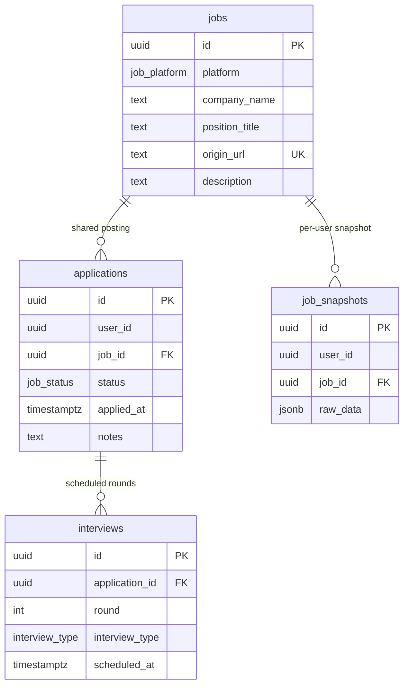

# 데이터베이스 스키마 설계 문서

## 1. 문제 정의

`supabase/migrations/`에는 스키마를 변경한 마이그레이션이 누적되어 있으나, 현재 저장소에는 아래 질문을 한 번에 설명하는 기준 문서가 부족합니다.

- 왜 `jobs`와 `applications`를 분리했는가
- 왜 `job_snapshots`가 별도 테이블인가
- 어떤 조회 패턴을 기준으로 인덱스를 만들었는가
- 어떤 테이블에 어떤 RLS(Row Level Security) 정책을 두었는가
- 각 마이그레이션이 어떤 문제를 해결했는가

본 문서는 현재 데이터베이스 구조의 설계 배경, 접근 제어 원칙, 인덱스 전략, 마이그레이션 의도를 정리한 프로젝트 기준 문서입니다.

## 2. 제약사항 / 성공 기준

### 제약사항

- 인증은 Supabase Auth를 사용하고, 데이터 접근 제어는 RLS에 의존합니다.
- 한 공고는 여러 사용자가 저장하거나 지원할 수 있습니다.
- 공고의 공개 정보와 사용자별 민감 정보는 분리해야 합니다.
- 애플리케이션 코드는 Server Action에서 Supabase 쿼리를 직접 호출하므로, 쿼리 패턴이 인덱스 설계에 직접 반영됩니다.

### 성공 기준

- 테이블 책임이 분리되어 있고, 데이터 소유권이 명확해야 합니다.
- 사용자 간 데이터 누출 없이 공고를 공유할 수 있어야 합니다.
- 목록, 상세, 통계, 면접 관리 흐름이 현재 인덱스로 설명 가능해야 합니다.
- 마이그레이션 히스토리를 시간순으로 읽었을 때 설계 변화의 의도가 드러나야 합니다.

## 3. 설계 선택지

### 선택지 A. 사용자별로 `jobs`를 따로 가진다

- 장점: RLS가 단순합니다.
- 단점: 같은 공고가 사용자마다 중복 저장됩니다.
- 단점: 공고 설명 수정 같은 공용 정보 보정이 중복됩니다.

### 선택지 B. 공고는 공유하고, 사용자 활동은 별도 테이블로 분리한다

- 장점: 같은 공고를 하나의 canonical row로 관리할 수 있습니다.
- 장점: 사용자별 상태, 메모, 스냅샷, 면접 정보의 소유권이 분명해집니다.
- 단점: 조인과 RLS 정책이 조금 더 복잡해집니다.

현재 프로젝트는 선택지 B를 기준 모델로 사용합니다.

## 4. 구현 방향

### 핵심 모델

- `jobs`: 공고의 공유 가능한 공개 정보
- `applications`: 사용자와 공고의 관계, 즉 "이 사용자가 이 공고를 어떤 상태로 관리하는가"
- `job_snapshots`: 사용자별 크롤링 원본 JSON 저장소
- `interviews`: 특정 지원(`application`)에 종속된 면접 일정

### 테이블 분리 원칙

#### `jobs`

`jobs`는 `(platform, origin_url)`를 기준으로 하나의 공고를 식별합니다.  
같은 채용 공고를 여러 사용자가 저장하더라도 공고 메타데이터는 하나의 row로 유지합니다.

공유되는 필드:

- `platform`
- `company_name`
- `position_title`
- `origin_url`
- `description`
- `created_at`

#### `applications`

지원 상태는 공고 자체의 속성이 아니라 사용자와 공고 사이의 관계입니다.  
따라서 `status`, `applied_at`, `notes`는 `jobs`가 아니라 `applications`에 둡니다.

이 구조의 효과:

- 같은 공고라도 사용자마다 상태가 다를 수 있고
- 사용자 소유 데이터에만 강한 RLS를 걸 수 있으며
- `jobs`를 공유하면서도 개인 데이터는 분리할 수 있습니다

#### `job_snapshots`

초기 구조에서는 `jobs.raw_data`에 크롤링 JSON을 저장했지만, 공유 테이블 안에 사용자별 수집 데이터가 들어가면 보안 경계가 약해집니다.  
이에 따라 `raw_data`를 `job_snapshots`로 이동하고 `(user_id, job_id)` 단위로 분리했습니다.

이 분리의 의미는 다음과 같습니다.

- 공고 메타데이터는 공유 가능
- 크롤링 원본 JSON은 사용자별 비공개 데이터
- 같은 공고를 저장한 두 사용자가 서로의 원본 데이터를 볼 수 없음

#### `interviews`

면접은 공고가 아니라 특정 지원 기록에 종속됩니다.  
따라서 `interviews.application_id -> applications.id` 구조를 사용하며, `round`는 동일 지원 안에서만 유일하면 충분합니다.

## 5. 현재 스키마 관계

## 6. 인덱스 전략

인덱스는 단순 나열이 아니라, 현재 Server Action과 RLS 평가 패턴을 기준으로 설명 가능해야 합니다.

### `jobs`

#### `UNIQUE (platform, origin_url)`

- 목적: 같은 플랫폼의 같은 공고 URL이 중복 생성되는 것을 방지
- 최적화 대상:
  - [`saveJobApplication.ts`](/Users/hyeon/Documents/projects/201-escape/lib/actions/saveJobApplication.ts)
  - `save_job_application()` RPC의 `ON CONFLICT (platform, origin_url)`
- 이유:
  - 공고 공유 모델의 핵심 식별자입니다.
  - 단순 유니크 제약이 아니라 upsert의 충돌 기준으로도 사용됩니다.

#### `idx_jobs_platform_created_at (platform, created_at DESC)`

- 목적: 플랫폼 단위 최신 공고 정렬 조회를 대비한 인덱스
- 현재 사용 현황:
  - 애플리케이션 코드에서 직접 활용하는 조회는 아직 없습니다.
- 유지 이유:
  - 초기 설계에서 플랫폼별 최신 공고 탐색을 염두에 둔 인덱스입니다.
  - 현재 기준으로는 미래 대비 인덱스에 가깝기 때문에, 실제 조회가 계속 없다면 제거 후보입니다.

### `applications`

#### `UNIQUE (user_id, job_id)`

- 목적: 한 사용자가 같은 공고를 중복 저장하거나 중복 지원하지 못하도록 보장
- 최적화 대상:
  - `save_job_application()` RPC의 `ON CONFLICT (user_id, job_id)`
  - 동일 공고 재저장 시 insert 대신 update로 처리하는 idempotent 저장 흐름
- 이유:
  - 비즈니스 규칙과 성능 요구를 동시에 만족합니다.

#### `idx_applications_user_status (user_id, status)`

- 목적: 사용자별 상태 필터링/집계 최적화
- 최적화 대상:
  - [`getStatCounts.ts`](/Users/hyeon/Documents/projects/201-escape/lib/actions/getStatCounts.ts)
  - [`getChartData.ts`](/Users/hyeon/Documents/projects/201-escape/lib/actions/getChartData.ts)
  - [`getApplications.ts`](/Users/hyeon/Documents/projects/201-escape/lib/actions/getApplications.ts)의 `user_id` 기준 목록 필터
  - [`updateApplicationStatus.ts`](/Users/hyeon/Documents/projects/201-escape/lib/actions/updateApplicationStatus.ts)의 `id + user_id` 조건 중 사용자 범위 축소
- 이유:
  - 이 서비스의 대부분 조회는 사용자 본인의 지원 목록에서 시작합니다.
  - 그 위에 상태별 집계가 반복되므로 `user_id` 선두 인덱스가 필요합니다.

#### `idx_applications_job_id (job_id)`

- 목적: 공고 기준으로 연결된 지원 레코드를 찾는 조인 비용 절감
- 최적화 대상:
  - `jobs` RLS 정책의 `EXISTS (SELECT 1 FROM applications a WHERE a.job_id = jobs.id AND a.user_id = auth.uid())`
  - [`updateJobDescription.ts`](/Users/hyeon/Documents/projects/201-escape/lib/actions/updateJobDescription.ts) 이후 `jobs` 업데이트 허용 판단
- 이유:
  - 이 인덱스는 화면 조회뿐 아니라 RLS 평가 비용 절감에 중요합니다.
  - `jobs`를 읽거나 수정할 때마다 정책 내부 서브쿼리가 `applications`를 참조합니다.

### `interviews`

#### `UNIQUE (application_id, round)`

- 목적: 한 지원 기록 안에서 같은 회차 면접이 중복되지 않도록 보장
- 최적화 대상:
  - [`upsertInterview.ts`](/Users/hyeon/Documents/projects/201-escape/lib/actions/upsertInterview.ts)의 `upsert(..., { onConflict: "application_id,round" })`
- 이유:
  - "회차 기반 저장"이라는 도메인 규칙과 upsert 성능이 연결됩니다.

#### `idx_interviews_application_id`

- 목적: 지원 상세 화면에서 특정 지원의 면접 목록 조회 최적화
- 최적화 대상:
  - [`getInterviews.ts`](/Users/hyeon/Documents/projects/201-escape/lib/actions/getInterviews.ts)
  - [`deleteInterview.ts`](/Users/hyeon/Documents/projects/201-escape/lib/actions/deleteInterview.ts)의 `application_id` 조건
- 이유:
  - 면접 조회는 항상 특정 `application_id` 단위로 일어납니다.

#### `idx_interviews_scheduled_at`

- 목적: 일정순 조회 또는 캘린더형 확장을 대비한 시간축 인덱스
- 현재 사용 현황:
  - 현재 코드에서는 직접적인 범위 검색이 없습니다.
- 유지 이유:
  - 운영 관점에서는 미래 일정 정렬, 알림, 캘린더 뷰에 바로 연결될 수 있는 인덱스입니다.
  - 다만 현재 기능 기준으로는 사용 근거가 약하므로 추후 재평가 대상입니다.

### `job_snapshots`

#### `UNIQUE (user_id, job_id)`

- 목적: 한 사용자가 같은 공고의 스냅샷을 하나만 갖도록 보장
- 최적화 대상:
  - `save_job_application()` RPC의 snapshot upsert
- 이유:
  - 사용자별 최신 스냅샷 1개라는 데이터 모델을 DB 레벨에서 강제합니다.

#### `idx_job_snapshots_user_id`

- 목적: 사용자 기준 스냅샷 접근 최적화
- 현재 사용 현황:
  - 앱 코드에서 직접 조회는 아직 없습니다.
- 유지 이유:
  - 향후 "내가 저장한 원본 데이터" 조회나 백오피스/디버깅 시 유용합니다.

#### `idx_job_snapshots_job_id`

- 목적: 특정 공고에 연결된 사용자별 스냅샷 탐색 최적화
- 현재 사용 현황:
  - 앱 코드 기준 직접 사용은 없습니다.
- 유지 이유:
  - 데이터 마이그레이션, 운영성 점검, 정책 검증에 유리합니다.
  - 제품 기능에서 사용하지 않는다면 제거 후보입니다.

### 인덱스 리뷰 포인트

- 현재 실제 사용 근거가 강한 인덱스:
  - `applications(user_id, status)`
  - `applications(job_id)`
  - `interviews(application_id)`
  - 각종 유니크 제약 인덱스
- 현재 제품 코드 기준 근거가 약한 인덱스:
  - `jobs(platform, created_at DESC)`
  - `interviews(scheduled_at)`
  - `job_snapshots(user_id)`
  - `job_snapshots(job_id)`

정리하면, 본 문서는 모든 인덱스를 동일하게 정당화하는 문서가 아니라 핵심 인덱스와 재검토 후보를 구분하는 문서여야 합니다.

## 7. RLS 정책 설명

RLS는 이 프로젝트의 데이터 소유권 모델을 실제로 강제하는 최종 제어 계층입니다.

### `jobs`

#### SELECT 정책

- 정책명: `Users can only read jobs they applied to`
- 의미:
  - 인증 사용자는 자신이 `applications`에 연결한 공고만 읽을 수 있습니다.
- 이유:
  - `jobs`는 공유 테이블이지만, 서비스가 공개 채용 공고 DB를 제공하는 것은 아닙니다.
  - 사용자가 직접 저장하거나 지원한 공고만 접근 가능해야 합니다.

#### INSERT 정책

- 정책명: `Service role can insert jobs`
- 의미:
  - 일반 인증 사용자는 `jobs`에 직접 insert할 수 없고, 서비스 롤 또는 `SECURITY DEFINER` RPC를 통해서만 생성됩니다.
- 이유:
  - 공고 생성 경로를 `save_job_application()`으로 집중시키기 위한 설계입니다.
  - 공개 테이블에 대한 임의 insert를 줄여 충돌 규칙과 공유 데이터 품질을 유지합니다.

#### UPDATE 정책

- 정책명: `Users can update jobs they applied to`
- 의미:
  - 사용자는 자신이 지원한 공고의 row에 대해서만 update 가능합니다.
- 실제 사용처:
  - [`updateJobDescription.ts`](/Users/hyeon/Documents/projects/201-escape/lib/actions/updateJobDescription.ts)
- 이유:
  - `description`은 공고의 공유 정보이지만, 지원자가 보정할 필요가 있습니다.
  - 다만 이 정책은 row-level 정책이므로 실제 수정 컬럼 범위는 애플리케이션 쿼리에서 제한합니다.

### `applications`

- 정책명: `Users can manage their own applications`
- 범위: `FOR ALL`
- 의미:
  - 사용자는 자신의 `applications.user_id = auth.uid()`인 행만 조회, 생성, 수정, 삭제할 수 있습니다.
- 실제 사용처:
  - 목록 조회: [`getApplications.ts`](/Users/hyeon/Documents/projects/201-escape/lib/actions/getApplications.ts)
  - 상세 조회: [`getApplicationDetail.ts`](/Users/hyeon/Documents/projects/201-escape/lib/actions/getApplicationDetail.ts)
  - 상태 변경: [`updateApplicationStatus.ts`](/Users/hyeon/Documents/projects/201-escape/lib/actions/updateApplicationStatus.ts)
- 이유:
  - 서비스의 개인화 상태 데이터는 모두 여기서 시작합니다.

### `interviews`

- 정책명: `Users can manage interviews for their own applications`
- 범위: `FOR ALL`
- 의미:
  - 사용자는 자신이 소유한 지원 기록에 연결된 면접만 접근할 수 있습니다.
- 정책 방식:
  - `interviews.application_id`가 가리키는 `applications.user_id`가 현재 사용자와 같은지 `EXISTS` 서브쿼리로 검사합니다.
- 실제 사용처:
  - 조회: [`getInterviews.ts`](/Users/hyeon/Documents/projects/201-escape/lib/actions/getInterviews.ts)
  - 저장: [`upsertInterview.ts`](/Users/hyeon/Documents/projects/201-escape/lib/actions/upsertInterview.ts)
  - 삭제: [`deleteInterview.ts`](/Users/hyeon/Documents/projects/201-escape/lib/actions/deleteInterview.ts)

### `job_snapshots`

- 정책명: `Users can manage their own job snapshots`
- 범위: `FOR ALL`
- 의미:
  - 사용자는 자신의 `(user_id, job_id)` 스냅샷만 읽고 쓸 수 있습니다.
- 이유:
  - 원본 크롤링 데이터는 가장 먼저 사용자별로 분리되어야 하는 민감 정보입니다.
  - 같은 공고를 저장한 다른 사용자와 절대 공유되면 안 됩니다.

### 더 이상 사용하지 않는 정책

초기 설계에는 `memos` 테이블과 `Users can manage memos of their own jobs` 정책이 있었지만, 정규화 단계에서 제거되었습니다.  
메모 책임은 현재 `applications.notes`로 이동했습니다.

## 8. RPC와 RLS의 역할 분담

`save_job_application()`은 `SECURITY DEFINER` 함수입니다.

도입 목적:

- `jobs`는 일반 사용자가 직접 insert할 수 없기 때문
- `jobs`, `applications`, `job_snapshots`를 한 트랜잭션에서 함께 upsert해야 하기 때문
- 공고 공유 모델에서 중복 생성과 사용자별 스냅샷 저장을 동시에 처리해야 하기 때문

역할 분담:

- RLS: 최종 접근 권한 강제
- RPC: 여러 테이블을 건드는 저장 흐름의 원자성 보장

## 9. 마이그레이션 히스토리

### 변화 요약

1. 사용자별 `jobs + memos` 단순 모델로 시작
2. 공유 공고 모델(`jobs`)과 사용자 관계(`applications`)로 정규화
3. 사용자별 민감 JSON을 `job_snapshots`로 분리
4. 저장 로직을 RPC로 통합
5. 공유 데이터 overwrite 및 과도한 read 권한을 점진적으로 축소
6. `SAVED` 상태와 공고 설명 수정 기능을 추가

### 마이그레이션별 의도

| 순서 | 파일                                                             | 실제 변경 의도                                                                           |
| ---- | ---------------------------------------------------------------- | ---------------------------------------------------------------------------------------- |
| 1    | `20260207143846_init_feedback.sql`                               | 초기에는 사용자별 `jobs`와 `memos`를 둔 단순 개인 저장 모델을 도입                       |
| 2    | `20260217032001_normalize_jobs_applications_interviews.sql`      | 공고 공유 모델로 재설계하고, `applications`와 `interviews`를 분리해 소유권을 명확히 함   |
| 3    | `20260217034235_secure_shared_jobs_with_snapshots.sql`           | 공유 `jobs`에서 사용자별 `raw_data`를 제거하고 `job_snapshots`로 분리해 보안 경계를 복구 |
| 4    | `20260219100500_add_save_job_application_rpc.sql`                | 공고 저장을 하나의 RPC 트랜잭션으로 묶어 idempotent upsert 경로를 제공                   |
| 5    | `20260219112000_harden_save_job_application_conflict.sql`        | 동일 공고 재저장 시 공유 `jobs` 데이터가 무분별하게 덮어써지지 않도록 충돌 처리 강화     |
| 6    | `20260219123000_simplify_save_job_application_status_update.sql` | 재저장 시 상태는 명시적으로 최신 입력값을 따르도록 단순화                                |
| 7    | `20260220080319_restrict_jobs_read_access.sql`                   | `jobs` 읽기 권한을 "인증 사용자 전체"에서 "해당 공고를 저장한 사용자"로 축소             |
| 8    | `20260312100000_add_saved_job_status.sql`                        | 관심 저장 단계와 실제 지원 단계를 구분하기 위해 `SAVED` 상태 추가                        |
| 9    | `20260312100001_update_save_job_application_default_status.sql`  | 신규 저장의 기본 상태를 `APPLIED`에서 `SAVED`로 바꿔 제품 흐름과 맞춤                    |
| 10   | `20260315000000_allow_applicants_to_update_job_description.sql`  | 지원자가 공유 공고 설명을 보정할 수 있도록 최소 범위의 update 정책 추가                  |

## 10. 트레이드오프

- 공유 `jobs` 모델은 중복을 줄이지만, RLS와 RPC 설계가 복잡해집니다.
- `description`을 공유 컬럼으로 두면 협업 수정이 가능하지만, 잘못된 수정이 모든 지원자에게 영향을 줄 수 있습니다.
- 일부 인덱스는 미래 기능 대비 성격이 있어, 현재 기준으로는 유지 비용 대비 효용이 낮을 수 있습니다.
- `SECURITY DEFINER` RPC는 편리하지만, 권한 경계를 함수 내부에서 더 엄격히 검토해야 합니다.
