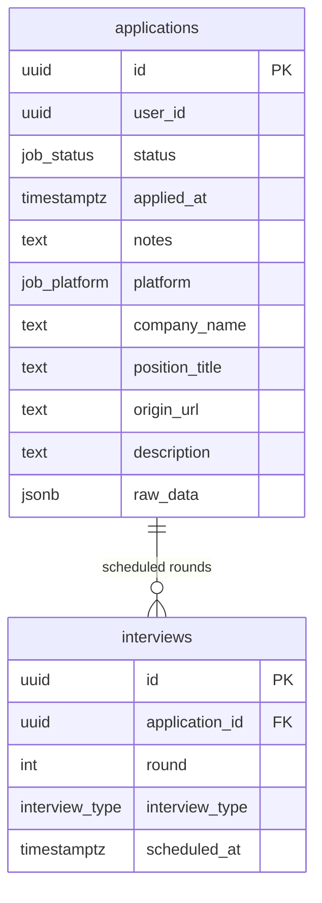

# 데이터베이스 스키마 설계 문서

## 1. 개요

현재 스키마는 `applications`를 사용자 소유 루트 엔티티로 사용합니다.  
지원 목록에서 보이는 한 행이 데이터베이스의 한 row와 대응되며, 공고 메타데이터와 지원 상태, 메모, 원본 데이터가 모두 `applications`에 저장됩니다.

테이블 구성은 다음 두 개로 단순화되어 있습니다.

- `applications`: 지원 목록의 기본 단위
- `interviews`: 특정 지원에 종속된 면접 일정

## 2. 설계 목표

- 제품의 핵심 개념인 "지원 목록"과 데이터베이스 루트 엔티티를 일치시킨다.
- 사용자별 공고를 완전히 분리해 데이터 소유권을 명확히 한다.
- 공고 정보, 상태, 메모, 원본 데이터를 한 곳에서 읽고 쓸 수 있게 한다.
- RLS와 서버 액션의 쿼리 경로를 단순화한다.

## 3. 테이블 구조

### `applications`

`applications`는 사용자별 지원 기록이자 공고 데이터의 원본입니다.

주요 컬럼:

- 식별/소유권
  - `id`
  - `user_id`
- 지원 상태
  - `status`
  - `applied_at`
  - `notes`
- 공고 메타데이터
  - `platform`
  - `company_name`
  - `position_title`
  - `origin_url`
  - `description`
- 원본 데이터
  - `raw_data`
- 공통 메타
  - `created_at`
  - `updated_at`

이 구조에서는 별도의 `jobs`, `job_snapshots` 테이블 없이 `applications` 한 row만으로 지원 상세 화면을 구성할 수 있습니다.

### `interviews`

`interviews`는 특정 지원에 속한 면접 일정입니다.

주요 컬럼:

- `id`
- `application_id`
- `round`
- `interview_type`
- `scheduled_at`
- `location`
- `scratchpad`
- `is_draft`
- `created_at`
- `updated_at`

면접 데이터는 독립 엔티티가 아니라 지원 기록의 하위 데이터로 취급합니다.

## 4. 스키마 관계

## 5. 인덱스 전략

인덱스는 현재 Server Action의 조회/저장 패턴을 기준으로 유지합니다.

### `applications`

#### `applications_user_platform_origin_url_key`

- 형태: `UNIQUE (user_id, platform, origin_url)`
- 목적:
  - 같은 사용자가 같은 플랫폼의 같은 공고 URL을 중복 저장하지 않도록 보장
  - 사용자 범위에서 저장 upsert 충돌 기준으로 사용
- 최적화 대상:
  - `save_application()` RPC

#### `idx_applications_user_status`

- 형태: `(user_id, status)`
- 목적:
  - 사용자별 상태 필터링과 통계 집계를 빠르게 수행
- 최적화 대상:
  - [`getStatCounts.ts`](/Users/hyeon/Documents/projects/201-escape/lib/actions/getStatCounts.ts)
  - [`getChartData.ts`](/Users/hyeon/Documents/projects/201-escape/lib/actions/getChartData.ts)
  - [`updateApplicationStatus.ts`](/Users/hyeon/Documents/projects/201-escape/lib/actions/updateApplicationStatus.ts)

#### `idx_applications_user_applied_at_desc`

- 형태: `(user_id, applied_at DESC)`
- 목적:
  - 지원 목록 최신순 정렬 최적화
- 최적화 대상:
  - [`getApplications.ts`](/Users/hyeon/Documents/projects/201-escape/lib/actions/getApplications.ts)

### `interviews`

#### `interviews_application_id_round_key`

- 형태: `UNIQUE (application_id, round)`
- 목적:
  - 동일 지원 안에서 같은 회차 면접 중복 방지
- 최적화 대상:
  - [`upsertInterview.ts`](/Users/hyeon/Documents/projects/201-escape/lib/actions/upsertInterview.ts)

#### `idx_interviews_application_id`

- 형태: `(application_id)`
- 목적:
  - 지원 상세에서 특정 지원의 면접 목록 조회 최적화
- 최적화 대상:
  - [`getInterviews.ts`](/Users/hyeon/Documents/projects/201-escape/lib/actions/getInterviews.ts)
  - [`deleteInterview.ts`](/Users/hyeon/Documents/projects/201-escape/lib/actions/deleteInterview.ts)

#### `idx_interviews_scheduled_at`

- 형태: `(scheduled_at)`
- 목적:
  - 시간순 조회와 향후 일정 기반 기능 확장 대비

## 6. RLS 정책

### `applications`

- 정책명: `Users can manage their own applications`
- 범위: `FOR ALL`
- 규칙:
  - `auth.uid() = user_id`
- 의미:
  - 사용자는 자신의 지원 기록만 조회, 생성, 수정, 삭제할 수 있습니다.

### `interviews`

- 정책명: `Users can manage interviews for their own applications`
- 범위: `FOR ALL`
- 규칙:
  - `interviews.application_id`가 가리키는 `applications.user_id`가 현재 사용자와 같을 때만 허용
- 의미:
  - 사용자는 자신의 지원 기록에 연결된 면접만 관리할 수 있습니다.

## 7. 저장 경로

공고 저장은 `save_application()` RPC를 사용합니다.

역할:

- `(user_id, platform, origin_url)` 기준 upsert
- 신규 저장과 재저장을 같은 경로로 처리
- `applications` 단일 row에 상태, 메모, 설명, 원본 데이터를 함께 저장

이 구조에서는 shared `jobs`를 만들기 위한 별도 RPC가 필요하지 않습니다.

## 8. 애플리케이션 코드와의 대응

현재 서버 액션은 `applications` 단독 조회/수정을 기준으로 동작합니다.

- 목록 조회: [`getApplications.ts`](/Users/hyeon/Documents/projects/201-escape/lib/actions/getApplications.ts)
- 상세 조회: [`getApplicationDetail.ts`](/Users/hyeon/Documents/projects/201-escape/lib/actions/getApplicationDetail.ts)
- 저장: [`saveJobApplication.ts`](/Users/hyeon/Documents/projects/201-escape/lib/actions/saveJobApplication.ts)
- 상태 수정: [`updateApplicationStatus.ts`](/Users/hyeon/Documents/projects/201-escape/lib/actions/updateApplicationStatus.ts)
- 메모 수정: [`updateApplicationNotes.ts`](/Users/hyeon/Documents/projects/201-escape/lib/actions/updateApplicationNotes.ts)
- 설명 수정: [`updateJobDescription.ts`](/Users/hyeon/Documents/projects/201-escape/lib/actions/updateJobDescription.ts)
- 면접 관리: [`getInterviews.ts`](/Users/hyeon/Documents/projects/201-escape/lib/actions/getInterviews.ts), [`upsertInterview.ts`](/Users/hyeon/Documents/projects/201-escape/lib/actions/upsertInterview.ts)

즉, 현재 구조의 핵심은 "지원 목록의 한 항목을 읽고 쓰는 데 별도 공고 조인이 필요하지 않다"는 점입니다.

## 9. 트레이드오프

- 장점:
  - 제품 용어와 데이터 모델이 일치합니다.
  - 권한 모델이 단순합니다.
  - 조회와 수정 경로에서 불필요한 조인이 줄어듭니다.
  - 공고 메타데이터와 사용자 상태를 한 row에서 추적할 수 있습니다.

- 단점:
  - 동일 공고가 사용자별로 중복 저장될 수 있습니다.
  - 공고 메타데이터의 전역 정합성은 별도 canonical row 없이 관리해야 합니다.
  - `raw_data`를 `applications`에 포함하므로 row 크기가 커질 수 있습니다.
